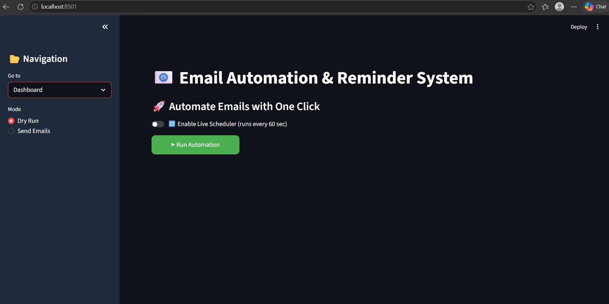
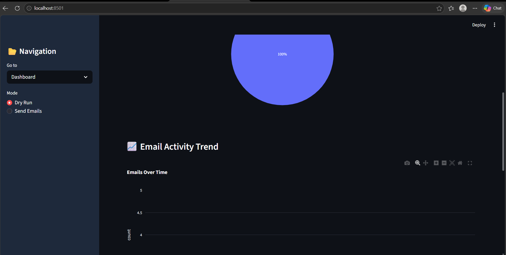
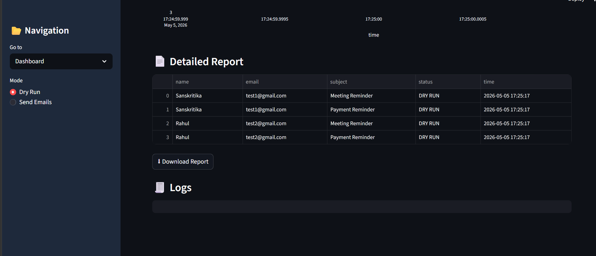
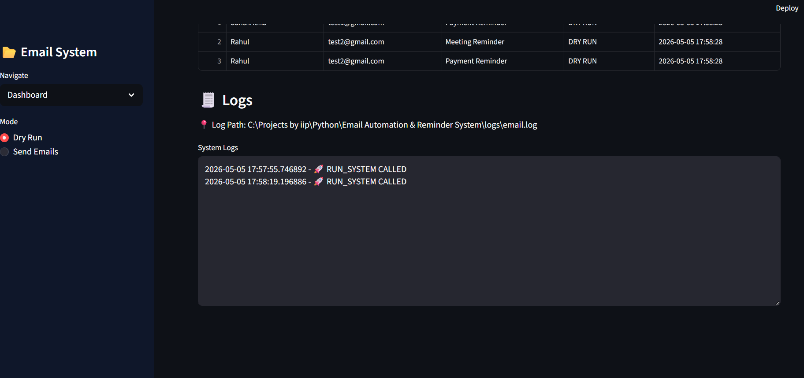

# 📧 Email Automation & Reminder System

## 🚀 Project Overview
The **Email Automation & Reminder System** is a Python-based automation project that sends scheduled and on-demand emails to users using SMTP. It includes a Streamlit dashboard for visualization, logging, analytics, and monitoring email performance.

This project simulates real-world **enterprise email workflows** used in companies for:
- Meeting reminders
- Payment alerts
- Course/class notifications
- Marketing campaigns
- Task automation

---

## 🎯 Problem Statement
Manual email sending is:
- Time-consuming
- Error-prone
- Not scalable

This system automates the entire process using Python.

---

## ⚙️ Features

✔ Automated Email Sending (SMTP)  
✔ Dry Run Mode (Safe testing)  
✔ Reminder Scheduling System  
✔ CSV-based Contact Management  
✔ Streamlit Dashboard UI  
✔ KPI Analytics (Success / Failed Emails)  
✔ Pie Charts & Trend Graphs  
✔ Live Logging System  
✔ Downloadable Reports  
✔ Dark Sidebar SaaS UI  

---

## 🛠 Tech Stack

- Python 🐍
- Streamlit 📊
- Pandas 📑
- Plotly 📈
- SMTP (smtplib) 📧
- OS & Logging 🧾

---

## 📁 Project Structure
Email-Automation-System/
│
├── data/
│ ├── contacts.csv
│ ├── reminders.csv
│
├── logs/
│ └── email.log
│
├── outputs/
│ └── report.csv
│
├── src/
│ ├── mailer.py
│ ├── utils.py
│
├── dashboard/
│ └── app.py
│
├── main.py
├── requirements.txt
└── README.md

---

## ▶️ How to Run

### 1️⃣ Install dependencies
```bash
pip install -r requirements.txt
2️⃣ Run Streamlit Dashboard
streamlit run dashboard/app.py
📊 Dashboard Preview
🟢 Main Dashboard

## screenshot here:
📸 Dashboard Preview

📊 Main Dashboard



📈 Analytics View





🧾 Logs Section


✔ Email automation using Python
✔ SMTP protocol understanding
✔ Scheduling & automation logic
✔ Real-world logging system
✔ Dashboard creation using Streamlit
✔ Data visualization with Plotly

🚀 Future Improvements
Add Gmail API integration
Add login system
Multi-user dashboard
Database (SQLite/PostgreSQL)
Email tracking (open/click analytics)
👩‍💻 Author

Built by Sanskritika
Project for Python Developer Portfolio 💼